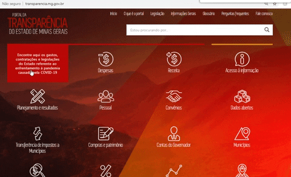

# [Notícia] Portal da Transparência cria seção específica para divulgar os dados relacionados ao enfrentamento a pandemia causa pela COVID-19

O Portal da Transparência de Minas Gerais, mantido pela Controladoria-Geral do Estado (CGE), disponibiliza uma seção específica para divulgar os dados relacionados ao enfrentamento a pandemia causa pela COVID-19 (coronavírus). Dentre outros temas, nessa seção é possível consultar:

* [Contratações emergenciais](http://www.transparencia.dadosabertos.mg.gov.br/dataset/contratacoes-coronavirus) realizadas com fulcro [Lei Federal nº 13.979/2020](http://www.planalto.gov.br/ccivil_03/_ato2019-2022/2020/lei/L13979.htm) e na [Lei Estadual nº 23.640/2020](https://www.almg.gov.br/consulte/legislacao/completa/completa.html?tipo=LEI&num=23640&comp=&ano=2020);

* [Compras -Programa de Enfrentamento Covid-19](http://transparencia.mg.gov.br/covid-19/compras-contratos): contratações executadas no Programa 26 - Enfrentamento dos Efeitos da Pandemia de Covid-19, criado pela [Lei nº 23.632/2020](https://www.almg.gov.br/consulte/legislacao/completa/completa-nova-min.html?tipo=LEI&num=23632&comp=&ano=2020&texto=consolidado);

* [Canal da Ouvidoria](http://www.ouvidoriageral.mg.gov.br/coronavirus) exclusivo para manifestações relacionadas a COVID-19 (coronavírus); e

* [Legislação e Normativos](http://transparencia.mg.gov.br/covid-19/legislacao-e-normativos) atualizados relativos às medidas de proteção e combate à COVID-19.

A criação dessa seção é mais uma iniciativa que reforça o compromisso do governo com a transparência.

