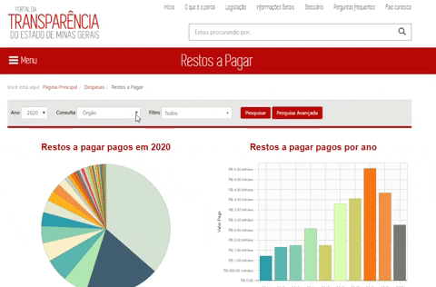

# [Notícia] Novos filtros na consulta de Restos a Pagar

Com o objetivo de facilitar as consultas do Portal da Transparência de Minas Gerais, a partir de agora o cidadão terá a disposição mais uma ferramenta.

A consulta de Restos a Pagar passa a contar com o Filtro "Favorecido", como já acontece na consulta de Despesa. Assim, o cidadão poderá consultar as despesas de exercícios anteriores utilizando as opções de consulta de Nome ou CPF/CNPJ do Credor pessoa física/jurídica. Essa opção de consulta por favorecido está disponível para todos os anos da consulta de Restos a Pagar, de 2002 a 2020.

Além disso, a consulta de Restas a Pagar passar a conta também com a Pesquisa Avançada, que permite ao usuário selecionar os parâmetros desejados para montar a sua própria consulta.

Clique no link abaixo e conheça as novas funcionalidades da consulta de Restos a Pagar.
http://www.transparencia.mg.gov.br/despesa-estado/restos-a-pagar
