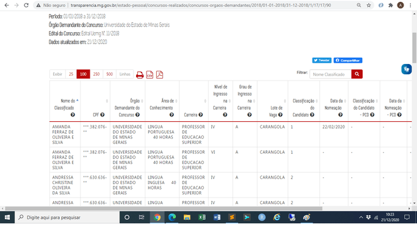

# [Notícia] Descaracterização do CPF nas consultas do Portal

As consultas do Portal da Transparência que necessitam da divulgação do Cadastro de Pessoa Física (CPF) para identificar o beneficiário de despesa pública passaram a apresentar essa informação de forma descaracterizada. Tal método consiste em ocultar os três primeiros dígitos e os dois últimos dígitos verificadores dos CPFs:

Assim, o que antes aparecia como ``000.000.000-00`` agora será visto como ``***.000.000-**``, em todas as formas de exibição (gráficos e tabelas; formulários de detalhamento; tabela do nível nome do classificado; pesquisa avançada; impressão e exportação para csv ou pdf).

Esse método foi aplicado nas consultas de:

* Despesas;
* Restos a Pagar;
* Compras e Contratos;
* Concursos realizados;
* Diárias;
* Viagens;
* Gestão da Frota;
* Patrimônio.

A divulgação do CPF na sua integralidade já vinha sendo objetivo de estudo pela equipe da Controladoria-Geral do Estado, pois vinha sendo objeto de questionamento frequente no canal “Fale Conosco” do Portal da transparência, principalmente após a publicação da Lei Geral de Proteção de Dados Pessoais/LGPD (Lei Federal nº 13.709, de 14 de agosto de 2018). 

Nesse sentido, o Grupo de Trabalho da LGPD no Estado, instituído pela Resolução Conjunta SEPLAG/CGE/SEF/AGE/PRODEMGE nº 10.064, de 29/7/2019, emitiu a Consulta Jurídica SEPLAG/SUBGOVES nº 01/2020, que versa sobre a publicização de dados pessoais no Portal da Transparência, à Advocacia Geral do Estado. Em resposta ao Grupo de Trabalho, a Advocacia Geral do Estado emitiu o Parecer Jurídico AGE 16.248, que apresentou opinião favorável à adoção das soluções pensadas pela consulente [Superintendência Central de Transparência].

A descaracterização de parte do número CPF e de outros documentos de identificação civil foram contemplados na identificação dos aprovados em concursos públicos, nos credores do Estado e dos terceiros responsáveis por algum patrimônio ou veículo.

Desse modo, a CGE preserva o dever de transparência, sedimentado na Lei de Acesso à Informação, e o dever de proteção dados pessoais, de que trata a Lei Geral de Proteção de Dados.
