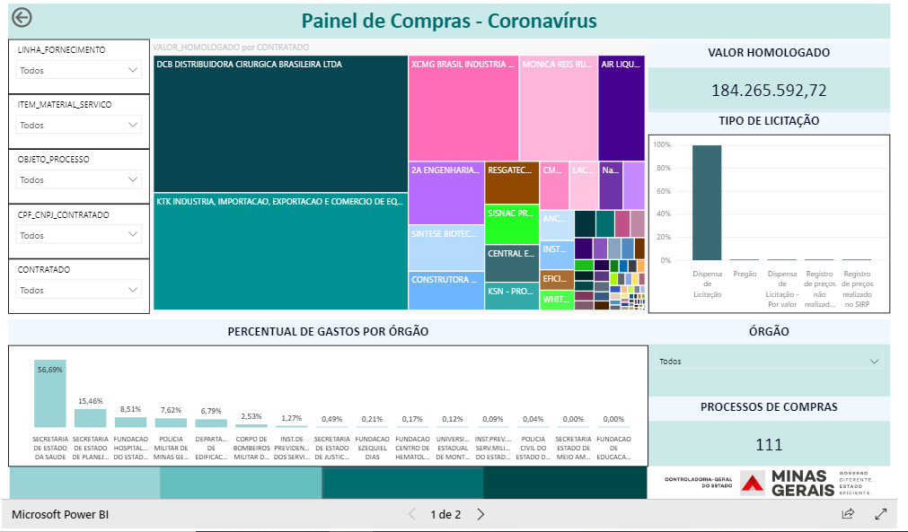

# [Notícia] Portal da Transparência amplia a qualidade das informações das ações de Combate a pandemia caudada pela COVID-19

Visando melhorar a qualidade das informações divulgadas no Portal da Transparência para as ações de enfrentamento ao combate a pandemia da COVID-19, a Controladoria-Geral do Estado em parceria com a Secretaria de Estado de Desenvolvimento Econômico (Sede), Secretaria de Estado de Desenvolvimento Social (Sedese), Ouvidoria-Geral do Estado de Minas Gerais (OGE),  Secretaria de Estado de Planejamento e Gestão (Seplag), Secretaria de Estado de Infraestrutura e Mobilidade (Seinfra); Defesa Civil de Minas Gerais e Companhia de Tecnologia da Informação do Estado de Minas Gerais (Prodemge) amplia o rol de funcionalidades do Portal da Transparência.

Dentre várias medidas implementadas, destaca-se a utilização da ferramenta do Power BI que permite visualizações interativas e recursos de business intelligence com uma interface simples para que os usuários naveguem pelos dados de [compras e contratações emergenciais]() para o enfrentamento da COVID-19. Também foi disponibilizada a relação das [doações recebidas](http://transparencia.mg.gov.br/covid-19/doacoes-coronavirus) pela força-tarefa, gerenciada pela Defesa Civil de Minas Gerais, e as informações sobre a destinação dessas doações.

Já com as parcerias promovidas entre a CGE, SEDESE e SEDE, o Portal da Transparência inicia a divulgação das [medidas de enfrentamento e mitigação dos efeitos socioeconômicos](http://transparencia.mg.gov.br/covid-19/medidas-estimulo-economico-protecao-social) da pandemia. Nessa seção o cidadão pode se informar sobre as políticas implementadas pelo governo com foco na proteção social e acessar as medidas econômicas adotadas para minimizar os impactos da pandemia na economia.

Outras duas ferramentas também estão disponíveis no Portal da Transparência:

* [Relatórios Estatísticos](http://transparencia.mg.gov.br/covid-19/ouvidoria-coronavirus) em resposta às manifestações recebidas pela Ouvidoria-Geral do Estado relacionadas a COVID-19; e

* [Relatório de pedidos de acesso à informação](http://www.transparencia.mg.gov.br/covid-19/acesso-a-informacao) em resposta às manifestações sobre ao Coronavírus.
