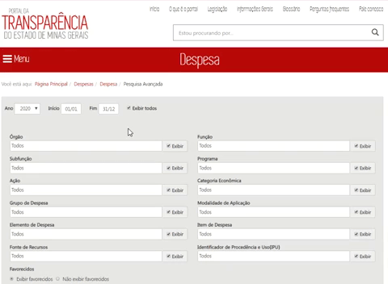

 # [Notícia] Nova funcionalidade nas Pesquisas Avançadas do Portal da Transparência

A partir de agora, o Portal da Transparência conta com uma nova funcionalidade nas Pesquisas Avançadas: opção de marcar/desmarcar todas as opções disponíveis para consulta.

O usuário ao entrar na Pesquisa Avançada das consultas do Portal, pode marcar/desmarcar o campo "Exibir Todos", e assim com apenas um clique selecionar todas as opções que deseja exibir na sua consulta personalizada.

Anteriormente, para selecionar todas as opções que desejava exibir, o usuário precisava marcar uma a uma, gastando um pouco mais de tempo. Com a nova funcionalidade, o usuário poderá escolher todas as opções de pesquisa utilizando apenas o campo "Exibir Todos".

Clique no link abaixo e conheça o campo "Exibir Todos" da pesquisa avançada.
http://www.transparencia.mg.gov.br/despesa-estado/despesa/despesa-pesquisa-avancada
