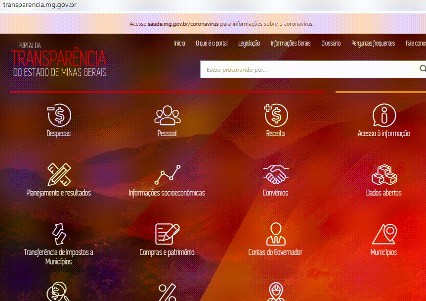
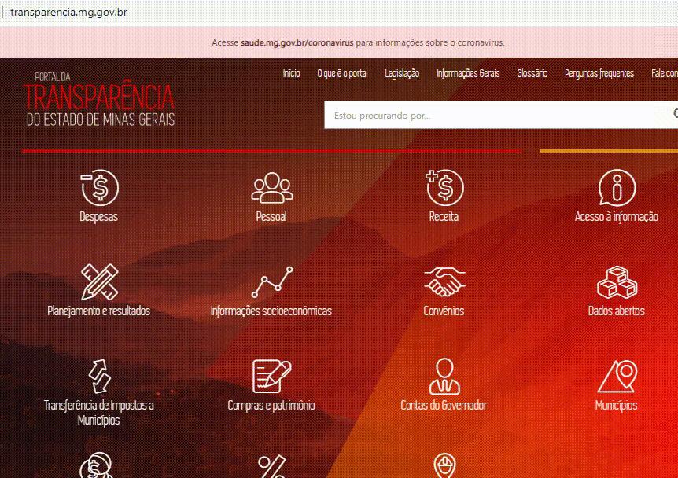
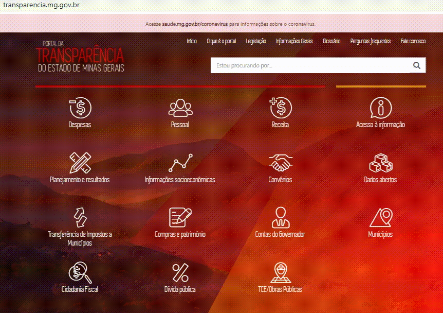
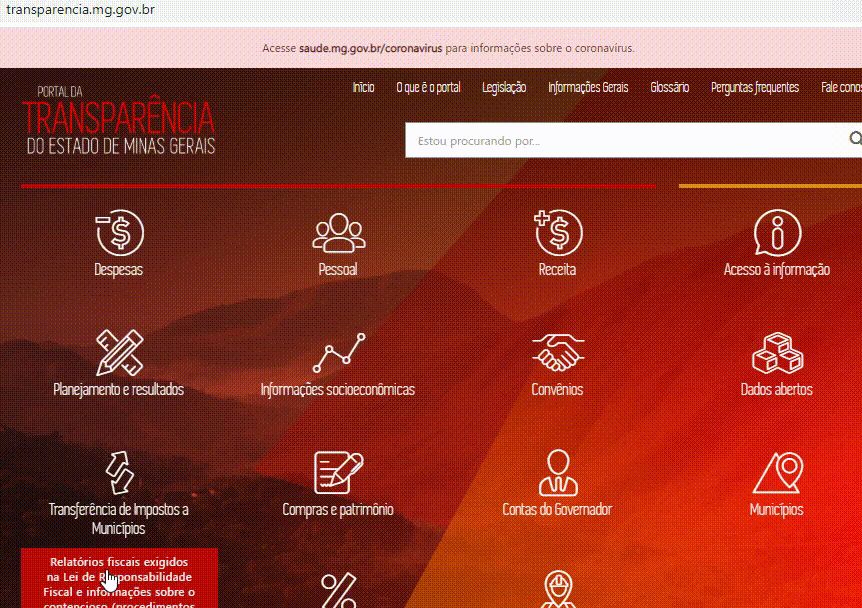

# Programa de Enfrentamento dos Efeitos da Pandemia de COVID-19

O Programa de Enfrentamento dos Efeitos da Pandemia de Covid-19, criado pela [Lei nº 23.632/2020](https://www.almg.gov.br/consulte/legislacao/completa/completa-nova-min.html?tipo=LEI&num=23632&comp=&ano=2020&texto=consolidado), tem como objetivo proteger os cidadãos mineiros dos impactos decorrentes da pandemia de Covid-19, causada pelo Coronavírus.

O programa possui diversas ações que buscam estabelecer, de forma coordenada e integrada, estratégias para a prevenção e o combate ao contágio pelo coronavírus no Estado.

No Portal da Transparência do Estado  é possível consultar:

* [As ações que integram o programa e a distribuição dos recursos por unidade orçamentária](#consulta-alteracao-orcamentaria); 
* [As aquisições e contratações por órgão](#consulta-compras-e-contratos);
* [A execução orçamentária do programa](#consulta-despesa).

## [Consulta Alteração orçamentária](http://transparencia.mg.gov.br/planejamento-e-resultados/proposta-lei-orcamentaria/alteracao-orcamentaria)

Apresenta a distribuição dos créditos adicionais incorporados à Lei Orçamentária Anual (LOA) do Estado. Nessa consulta também é possível consultar a origem dos recursos através do campo “Fonte de Recurso”.

## [Consulta Compras e contratos](http://transparencia.mg.gov.br/compras-e-patrimonio/compras-e-contratos)

Apresenta informações de todos os processos de compras de materiais, bens e serviços efetivados pelo Estado, que contenham itens de compra já homologados; bem como os contratos celebrados pelo Estado.  Dentre outros assuntos, nessa consulta é possível ter acesso ao quantitativo, valor e itens de bens ou serviços adquiridos pelo Estado para o enfretamento à pandemia.

## [Consulta Despesa](http://transparencia.mg.gov.br/despesa-estado/despesa)

Possui informações de todas as despesas do Estado, de todos os entes, órgãos e entidades que utilizam o Sistema Integrado de Administração Financeira de Minas Gerais – SIAFI/MG. A execução orçamentária e financeira das despesas, com atualização diária, podem ser acompanhadas através de 2 opções.

### Opção 1

### Opção 2

