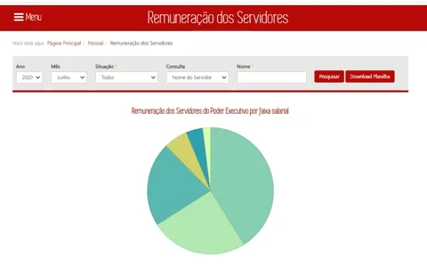
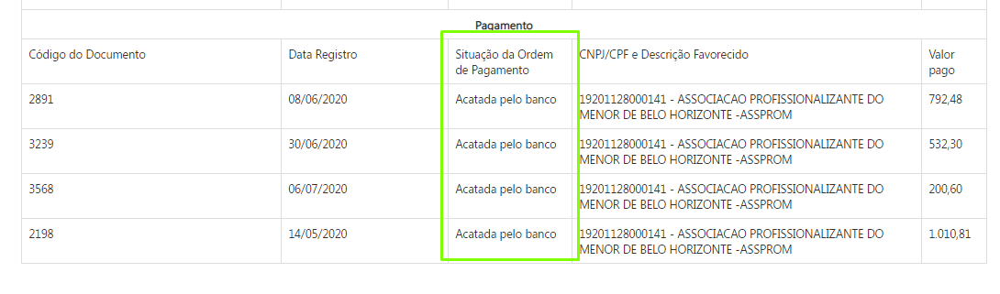

# [Notícia] Novas funcionalidades no Portal de Transparência: remuneração e valor pago

Com os objetivos de agregar informações e facilitar a navegação às consultas do Portal da Transparência de Minas Gerais, o cidadão agora tem à disposição novas funcionalidades.

A consulta de Remuneração de servidores do Poder Executivo Estadual foi reestruturada, de forma que o cidadão poderá consultar o histórico mensal da remuneração de determinado servidor, numa mesma página, bem como realizar o download desse histórico, que inclui também a situação funcional do servidor selecionado em cada mês.

Além disso, atendendo a demandas dos cidadãos o formulário de detalhamento das consulta de Despesa, Restos a Pagar e Diárias passa a exibir a situação da ordem de pagamento. Essa alteração visa sanar as dúvidas dos credores sobre a data do efetivo depósito dos valores registrados como pagos no Portal de Transparência.

