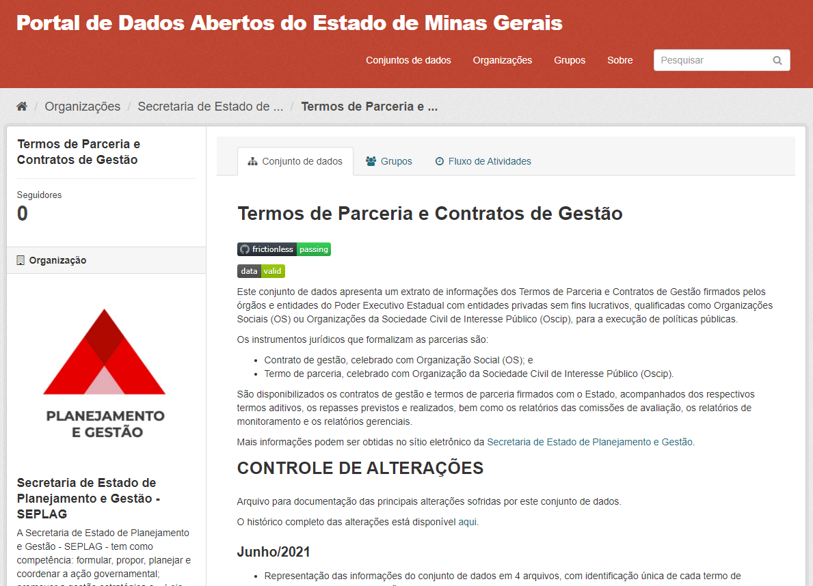
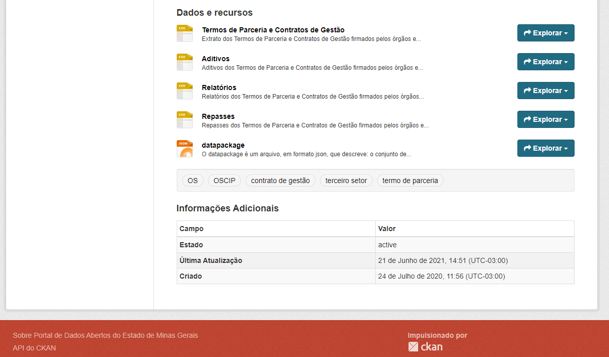

# [Notícia] Consulta de Termos de Parceria e Contratos de Gestão mais informativa

A partir de 21 de junho de 2021, a consulta de Termos de Parceria e Contratos de Gestão passa a apresentar novos dados visando ampliar a qualidade das informações disponibilizadas.  

A consulta apresenta um extrato das informações dos Termos de Parceria e Contratos de Gestão firmados pelos órgãos e entidades do Poder Executivo Estadual com entidades privadas sem fins lucrativos, qualificadas como Organizações da Sociedade Civil de Interesse Público (Oscip), para a execução de políticas públicas.

Com a alteração realizada a partir de 21/06/2021, passam a ser disponibilizados em 04 (quatro planilhas) os dados sobre a formalização dos Termos de Parceria e Contratos de Gestão, além dos termos aditivos, os repasses previstos e realizados, bem como os relatórios das comissões de avaliação, divididos em relatórios de monitoramento e relatórios gerenciais. Um resumo contendo as alterações realizadas no conjunto de dados também estão disponíveis para acompanhamento das mudanças implementadas.

Os dados são de responsabilidade da Secretaria de Estado de Planejamento e Gestão - SEPLAG e serão atualizados mensalmente pela equipe da Diretoria de Transparência Ativa/DTA-CGE.

Acesso o [Portal de Dados Abertos](https://dados.mg.gov.br/dataset/termos-parceria-contratos-gestao) e confira as alterações implementadas no conjunto de dados.
